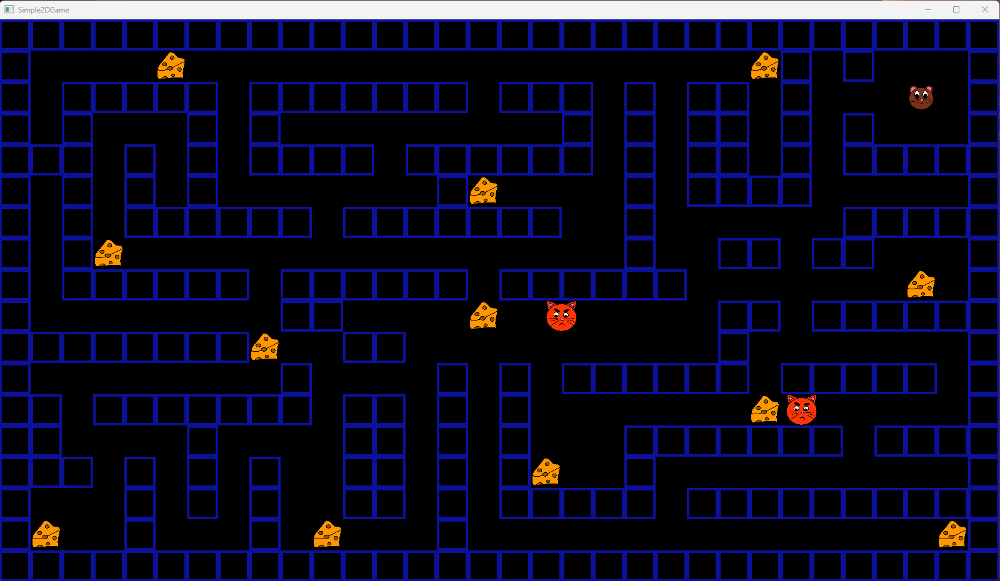
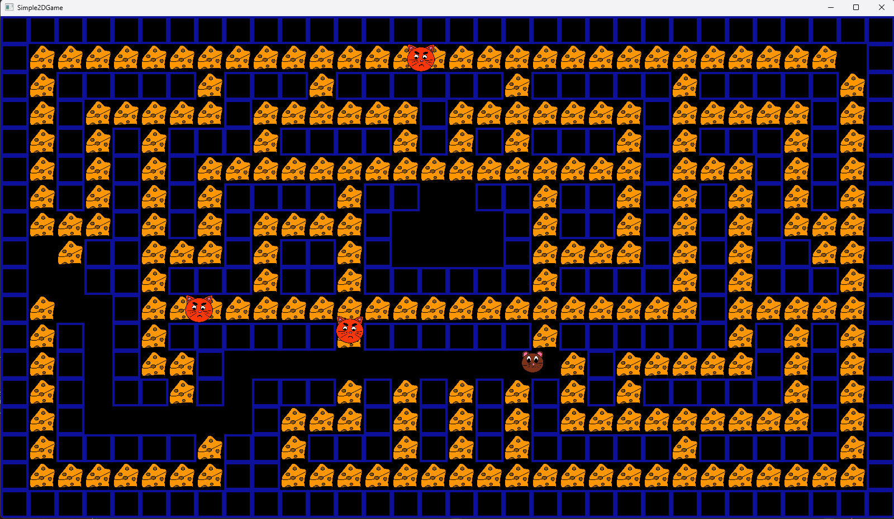
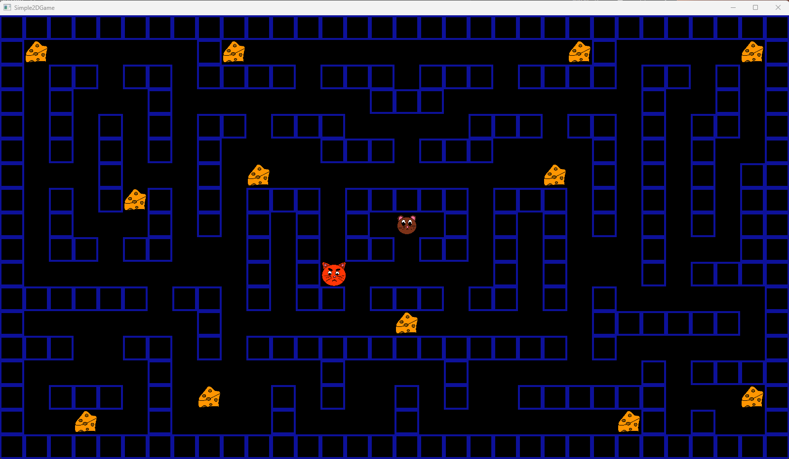
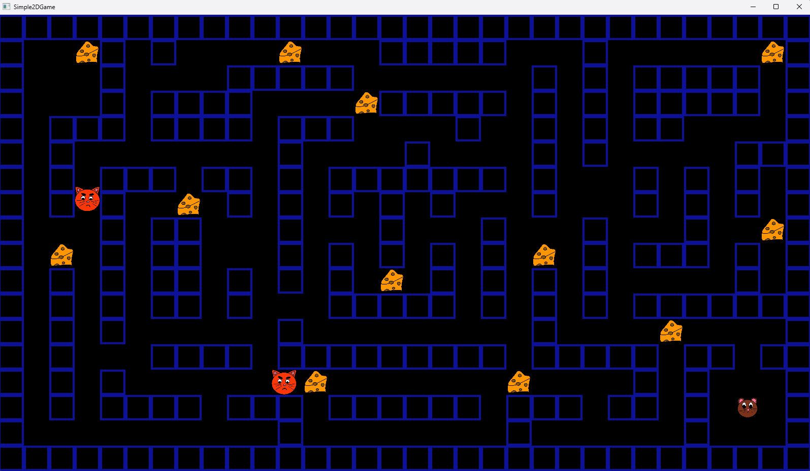
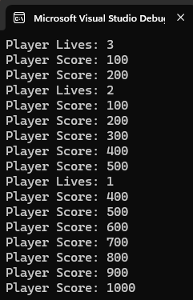

# Simple2D
**Contents**  
[1. Info](#info)  
[2. Controls](#controls)  
[3. Goal](#goal)  
[4. Results](#results)   
[5. Where to Play](#where-to-play)
[6. Pictures](#pictures)

## Info
**Date:** September 2024  

Made in a custom C++ project.  
Made over a long weekend.

## Controls
**WASD / Arrow Keys:** Move player  
**ESCAPE Key       :** Close game  
**R Key            :** Reset to a randomly chosen level  
**1 Key            :** Reset to level 1  
**2 Key            :** Reset to level 2  
**3 Key            :** Reset to level 3  
**4 Key            :** Reset to level 4  

## Goal
**Project:** To make a code sample that briefly shows my programming abilities.  
**Game:** A 2D top-down cat and mouse style game.  

The mouse(the player) must eat all the cheese to win.  
The mouse loses if they lose all of their lives to the cats.  

## Results
- 4 Levels read in from txt files
- Graphics displayed using DirectX 12
- Input and Window using GLFW
- Enemy pathing using A Star Algorithm  
- player score and lives output to console when changed  

## Where to Play
**In Solution:**  
Dependencies are not committed to repo, so follow the instruction below to get them locally, if you wish to run the game from the solution.  

**To get the dependencies to run game in the solution,** run "vcpkg install" in the command line  from the folder that has the manifest ("vcpkg.json")  

**From Build:**  
In the builds folder there is the most recent build in a zip file.  Unzip it and you are good to go!

## Pictures

Level 1
  

  
Level 2
  

  
Level 3
  

  
Level 4
  

  
What console output looks like. Player lives and score is output here.  
  